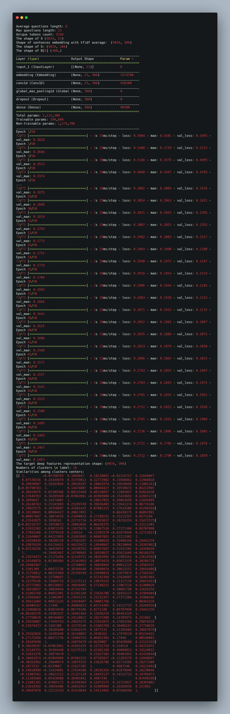

# text_clustering_with_CNN

This repo re-implemented the algorighm in <b><i>Self-Taught Convolutional Neural Networks for Short Text Clustering<i></b>

The corpus I used is in TURKISH, so I used the word vectors from fastText.

To run this repo, just install requirements and run the <i>main.py<i>.

The goal of this algorithm is to get the deep feature respresentations for input sentences.

Here is an sample output.

Ref: 
* https://github.com/jacoxu/STC2
* https://github.com/zqhZY/short_text_cnn_cluster

